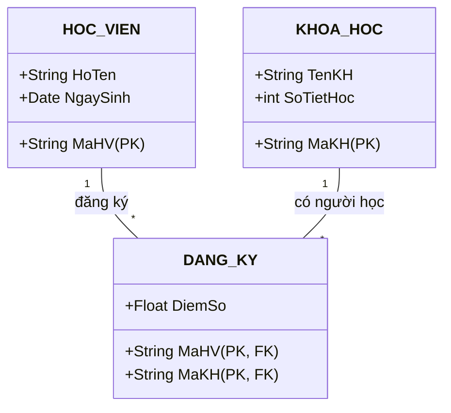

# BÁO CÁO BÀI TẬP: THỰC HÀNH THIẾT KẾ ERD VÀ CHUẨN HÓA DỮ LIỆU HỆ THỐNG EDUSMART

> 👤 **Học viên:** Đỗ Hoàng Sơn | **Mã SV:** PTIT-HCM-066
> 🏫 **Môn học:** IT105-K25-Phan-tich-thi-t-k-h-th-ng

---

## 📊 Sơ đồ thiết kế hệ thống (Class Diagram)

> 💡 *Sơ đồ dưới đây được render tự động trực tiếp trên GitHub bằng Mermaid. Bạn cũng có thể tải file **`bt2.drawio`** trong repository này để mở và chỉnh sửa trực tiếp trên [Draw.io (diagrams.net)](https://app.diagrams.net).* 

---

## Nhiệm vụ 1: Xác định Entity, Attribute, Khóa chính

Sau khi phân tích bối cảnh bài toán phân hệ Đăng ký khóa học của nền tảng EduSmart, tôi tiến hành xác định các thực thể, thuộc tính và khóa chính tương ứng. Hệ thống đòi hỏi lưu trữ thông tin học viên, thông tin khóa học và bảng trung gian ghi nhận kết quả đăng ký.

Dưới đây là bảng hoàn thiện cho bước phân tích thực thể:

- Thực thể HOC_VIEN đóng vai trò lưu trữ thông tin cá nhân học viên với khóa chính là MaHV.
- Thực thể KHOA_HOC quản lý thông tin danh mục các khóa học trực tuyến với khóa chính là MaKH.
- Thực thể trung gian DANG_KY sinh ra để giải quyết mối quan hệ N-N giữa HOC_VIEN và KHOA_HOC, đồng thời gánh thêm thuộc tính DiemSo.

| Entity | Attribute cần lưu | Khóa chính (PK) đề xuất |
| --- | --- | --- |
| HOC_VIEN | MaHV, HoTen, NgaySinh | MaHV |
| KHOA_HOC | MaKH, TenKH, SoTietHoc | MaKH |
| DANG_KY | MaHV, MaKH, DiemSo | Khóa ghép: (MaHV, MaKH) |

## Nhiệm vụ 2: Thiết kế quan hệ N-N qua thực thể trung gian

Mối quan hệ trực tiếp N-N giữa HOC_VIEN và KHOA_HOC không thể biểu diễn trực tiếp trong mô hình quan hệ cơ sở dữ liệu dạng bảng, do đó bắt buộc phải tách thành 2 quan hệ 1-N thông qua thực thể trung gian 'DANG_KY'.

Tôi đã dựng file 'edu_smart_erd.drawio' để nộp kèm repository với cấu trúc liên kết chuẩn xác như sau:

- Quan hệ 1: HOC_VIEN (1) kết nối tới DANG_KY (N) thông qua khóa ngoại 'MaHV'.
- Quan hệ 2: KHOA_HOC (1) kết nối tới DANG_KY (N) thông qua khóa ngoại 'MaKH'.
- Thực thể trung gian 'DANG_KY' sở hữu khóa chính là cặp khóa ghép '(MaHV, MaKH)' kết hợp từ khóa ngoại của 2 bảng cha, đảm bảo tính toàn vẹn tham chiếu tuyệt đối.

## Nhiệm vụ 3: Chuẩn hóa dữ liệu và Khắc phục vi phạm 2NF

Phân tích vi phạm dạng chuẩn 2NF (Second Normal Form):

Một bảng đạt chuẩn 2NF khi nó đạt chuẩn 1NF và mọi thuộc tính không khóa đều phụ thuộc hàm đầy đủ vào toàn bộ khóa chính. Ở bảng nháp trên, khóa chính là cặp '(MaHV, MaKH)'. Ta thấy cột 'TenKH' chỉ phụ thuộc vào một phần của khóa chính là 'MaKH' (biết mã khóa học là suy ra được tên khóa học, không cần quan tâm đến mã học viên là gì).

Hiện tượng này gọi là 'Phụ thuộc bộ phận' (Partial Dependency), dẫn đến vi phạm dạng chuẩn 2NF và gây ra các bất thường (anomaly) về cập nhật, dư thừa dữ liệu (ví dụ: tên khóa học 'Nhập môn Lập trình' bị lặp lại nhiều lần ở các dòng của HV01 và HV02).

Hướng khắc phục:

Tách bảng nháp ban đầu thành 2 bảng riêng biệt để triệt tiêu hoàn toàn sự phụ thuộc bộ phận:

- Bảng 1 (KHOA_HOC): Lưu danh mục khóa học gồm 'MaKH' (PK), 'TenKH', 'SoTietHoc'. Lúc này 'TenKH' phụ thuộc hoàn toàn vào khóa chính 'MaKH'.
- Bảng 2 (DANG_KY): Lưu thông tin đăng ký học gồm 'MaHV', 'MaKH' (cặp khóa chính ghép đồng thời là khóa ngoại), và thuộc tính 'DiemSo' (thuộc tính này phụ thuộc đầy đủ vào cả 'MaHV' và 'MaKH').

| MaHV | MaKH | TenKH | DiemSo |
| --- | --- | --- | --- |
| HV01 | KH01 | Nhập môn Lập trình | 8.5 |
| HV01 | KH02 | Thiết kế CSDL | 9.0 |
| HV02 | KH01 | Nhập môn Lập trình | 7.0 |

---

## 📁 Danh sách tệp tin nộp bài trong Repository
- 📝 `bt2.docx`: Báo cáo tài liệu phân tích nghiệp vụ hoàn chỉnh.
- 🎨 `bt2.drawio`: File thiết kế sơ đồ chuẩn theo quy định đề bài (mở trực tiếp bằng [Draw.io](https://app.diagrams.net) hoặc Lucidchart).
